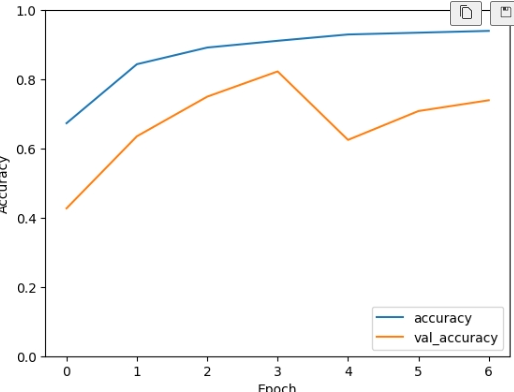

# Laporan Proyek Machine Learning - Jonathan Immanuel
## Domain Proyek
Dengan berkembangnya penggunaan kode QR dan barcode di berbagai industri, kebutuhan akan sistem pemindaian yang akurat dan efisien menjadi semakin penting. 

Metode pemindaian tradisional dapat memakan waktu dan rawan kesalahan.
Ini mengarah pada pengembangan sistem pemindaian yang menggunakan kecerdasan buatan untuk meningkatkan akurasi dan kecepatan.

### Rubrik Proyek
- Masalah tersebut harus diselesaikan karena kurangnya penelitian mengenai model yang dapat mengklasifikasikan dua objek yang sangat mirip. Masalah ini dapat diselesaikan menggunakan metode Deep Learning, yaitu Convolutional Neural Network (CNN).

- Referensi:
    1. [QR Code Detection Using Convolutional Neural Networks] (https://doi.org/10.1109/ARIS.2015.7158354)
    2. [Deteksi Citra dan Posisi Barcode Menggunakan Metode Oriented Fast and Rotated Brief (ORB) dan Maximally Stable Extremal Regions (MSER)] (https://ejurnal.its.ac.id/index.php/teknik/article/download/85214/7089)

## Business Understanding
### Problem Statements
- Bagaimana cara mendeteksi dan mengklasifikasikan kode QR dan barcode dengan akurat dan efisien?
- Model apa yang paling cocok untuk mengklasifikasikan kode QR dan barcode?

### Goals
- Membuat model yang dapat mendeteksi dan mengklasifikasikan kode QR dan barcode dengan akurat dan efisien.
- Mencari model yang paling cocok untuk mengklasifikasikan kode QR dan barcode.

### Solution Statements
- Membangun model menggunakan arsitektur Convolutional Neural Network (CNN) sendiri.
- Membangun model menggunakan transfer learning dari model yang sudah ada (fine-tuning).

## Data Understanding
Data yang akan digunakan adalah dataset pribadi yang digabung dari 2 dataset umum yang kemudian disimpan di platform Kaggle. Dataset ini berisi 3 kelas, yaitu barcode, qr, dan both (barcode dan qr). Dataset ini berisi 992 gambar dengan ukuran bermacam-macam.

Struktur dataset dibuat cocok dengan struktur dataset pada platform Kaggle, yaitu:
```
dataset
|__ barcode
|   |__ barcode-1.jpg
|   |__ barcode-2.jpg
|   |__ ...
|__ both
|   |__ both-1.jpg
|   |__ both-2.jpg
|   |__ ...
|__ qr
|   |__ qr-1.jpg
|   |__ qr-2.jpg
|   |__ ...
```


Dataset dapat diunduh [disini](https://www.kaggle.com/datasets/jonathanimmanuel/barcode-and-qr).

### Variabel-Variabel
- `image`: Gambar kode QR atau barcode atau keduanya (barcode dan qr) dalam format .jpg
- `label`: Kategori dari gambar, yaitu barcode, qr, atau both, dapat menggunakan label dari nama folder dataset

### Tahap Memahami Data
Menggunakan Exploratory Data Analysis (EDA) untuk memahami data, yaitu:
- Melihat jumlah gambar pada setiap kelas
- Melihat ukuran gambar
- Melihat contoh gambar dengan pustaka matplotlib.pyplot

## Data Preparation
- Melakukan normalisasi gambar agar memiliki nilai pixel antara 0 dan 1 dan mempercepat proses training
- Membagi data menjadi data latih, data validasi, dan data uji dengan perbandingan `80:10:10` agar model dapat belajar, dievaluasi, dan diuji dengan baik

## Modeling
### Convolutional Neural Network (CNN)
Convolutional Neural Network (CNN) adalah salah satu jenis arsitektur Deep Learning yang paling populer untuk tugas penglihatan komputer. CNN memiliki kemampuan untuk mempelajari fitur-fitur dari data gambar dan mengklasifikasikan data gambar tersebut.

Kelebihan CNN:
- Dapat mempelajari fitur-fitur dari data gambar
- Dapat mengklasifikasikan data gambar
- Dapat digunakan untuk tugas penglihatan komputer lainnya

Kelemahan CNN:
- Memerlukan waktu yang lama untuk training
- Memerlukan banyak data untuk training
- Memerlukan komputer dengan spesifikasi tinggi

### Tahap Pembuatan Model
- Mengawali arsitektur model dengan Sequential dan layer Input
- Menambahkan layer konvolusi dan pooling untuk mempelajari fitur-fitur dari data gambar
- Menambahkan layer BatchNormalization untuk mempercepat proses training
- Menambahkan layer GlobalMaxPooling untuk mengurangi dimensi data dan memperkecil jumlah parameter sehingga lebih efisien
- Menambahkan layer Dense untuk mempelajari hubungan antara fitur-fitur yang sudah dipelajari oleh layer konvolusi dan pooling sebelumnya dan mengklasifikasikan data gambar

### Parameter Model
| Parameter | Nilai |
| --- | --- |
| Optimizer | Adam |
| Loss | Categorical Crossentropy |
| Metrics | Accuracy |
| Epochs | 15 |
| Batch Size | 32 |
| Learning Rate | 0.001 |
| Dropout | 0.4 |
| Activation Function | ReLU, Softmax |
| Kernel Size | 3x3 |
| Pool Size | 2x2 |
| Callbacks | EarlyStopping |

### Proses Peningkatan Model
- Mengubah arsitektur model, terutama pada layer konvolusi dan dense
- Menggunakan layer lainnya, seperti layer dropout, layer flatten, dan layer global average pooling yang dapat membantu model belajar lebih baik
- Mengubah parameter model, seperti optimizer, loss, metrics, epochs, batch size, learning rate, dan dropout

## Evaluation
### Metrics
- Accuracy: Akurasi dari model, yaitu jumlah prediksi yang benar dibagi dengan jumlah total prediksi
- Loss: Nilai dari fungsi loss, yaitu seberapa besar kesalahan model dalam memprediksi data
- Confusion Matrix: Matriks yang menunjukkan jumlah prediksi yang benar dan salah dari setiap kelas
- Classification Report: Laporan yang menunjukkan precision, recall, f1-score, dan support dari setiap kelas

### Penjelasan Metrics
- Accuracy: Rumus = (TP + TN) / (TP + TN + FP + FN) = (Jumlah prediksi yang benar) / (Jumlah total prediksi)
- Loss: Rumus = -1 * (1 / N) * Σ (y * log(y_pred) + (1 - y) * log(1 - y_pred)) = Seberapa besar kesalahan model dalam memprediksi data
- Confusion Matrix: Matriks yang menunjukkan jumlah prediksi yang benar dan salah dari setiap kelas (True Positive, False Positive, False Negative, True Negative)
- Classification Report:
    1. Precision: Rumus = TP / (TP + FP) = Seberapa akurat model dalam memprediksi data positif
    2. Recall: Rumus = TP / (TP + FN) = Seberapa akurat model dalam memprediksi data yang seharusnya positif
    3. F1-Score: Rumus = 2 * (Precision * Recall) / (Precision + Recall) = Seberapa akurat model dalam memprediksi data positif dan negatif
    4. Support: Jumlah data yang benar dari setiap kelas (True Positive + False Negative)

### Hasil Evaluasi


Dari hasil pelatihan, model mencapai akurasi tertinggi pada epoch ke-6 sebesar 0.93 pada data latih dan 0.71 pada data validasi yang kemudian dihentikan pada epoch ke-7 karena terjadi overfitting.

Pada data uji, model mencapai akurasi sebesar 0.77, sehingga model dapat dikatakan baik dalam mengklasifikasikan kode QR dan barcode.


Dari Confusion Matrix dan Classification Report, didapat bahwa:
- **Barcode:** Model berperforma sangat baik pada klasifikasi barcode dengan presisi 0.84 dan recall 1.00. Selain itu, model dapat mengidentifikasi dengan benar semua gambar barcode di data uji.
- **Both (barcode dan QR):** Model kesulitan dengan gambar yang mengandung barcode dan kode QR. Meskipun model dapat mengidentifikasi dengan benar 40% gambar ini (recall), presisinya cukup rendah di 0.12, menunjukkan bahwa banyak gambar salah diidentifikasi sebagai barcode dan kode QR.
- **Kode QR:** Model memiliki presisi tinggi 0.95 untuk kode QR, yang berarti model dapat memprediksi gambar sebagai kode QR dengan benar 95% dari waktu. Namun, recallnya relatif rendah di 0.68, menunjukkan bahwa model kesulitan dalam mengidentifikasi kode QR di dataset.
- **Keseluruhan:** Akurasi keseluruhan adalah 0.77, yang berarti model dapat memprediksi dengan benar 77% dari waktu. Nilai f1-score rata-rata tertimbang adalah 0.80, menunjukkan performa yang seimbang di semua kelas.

Hal ini menunjukkan bahwa model memerlukan penyetelan lebih lanjut atau lebih banyak data pelatihan, terutama untuk gambar yang mengandung kedua kode.

Model juga dapat mendapatkan manfaat dari teknik untuk menangani data yang tidak seimbang jika kelas 'both' memiliki jumlah sampel yang lebih sedikit.

Boleh juga mencoba transfer learning dari model yang sudah ada (fine-tuning) untuk mendapatkan performa yang lebih baik.
